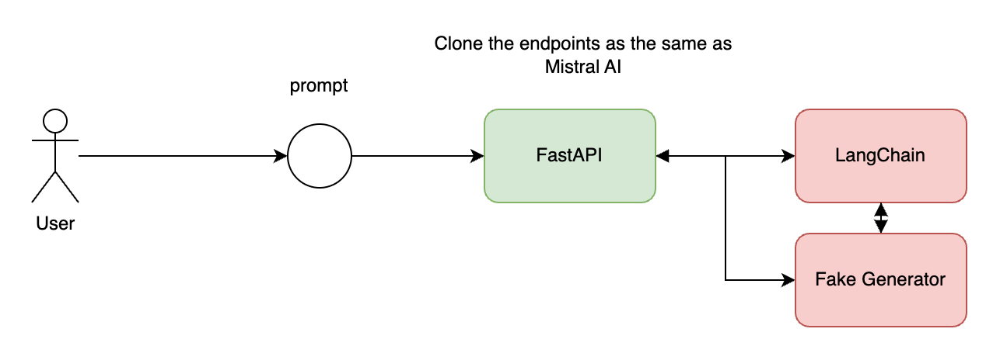
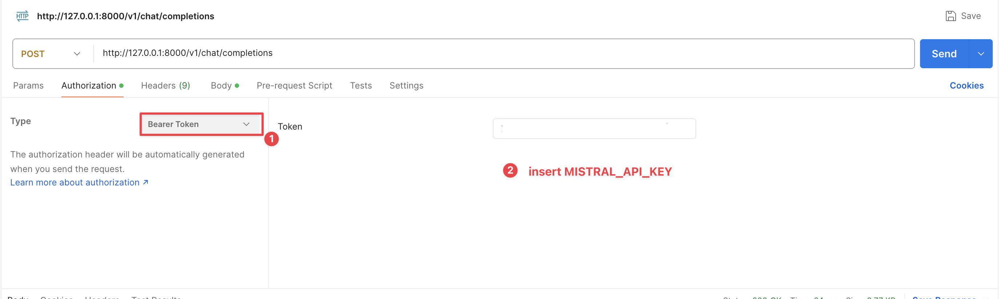
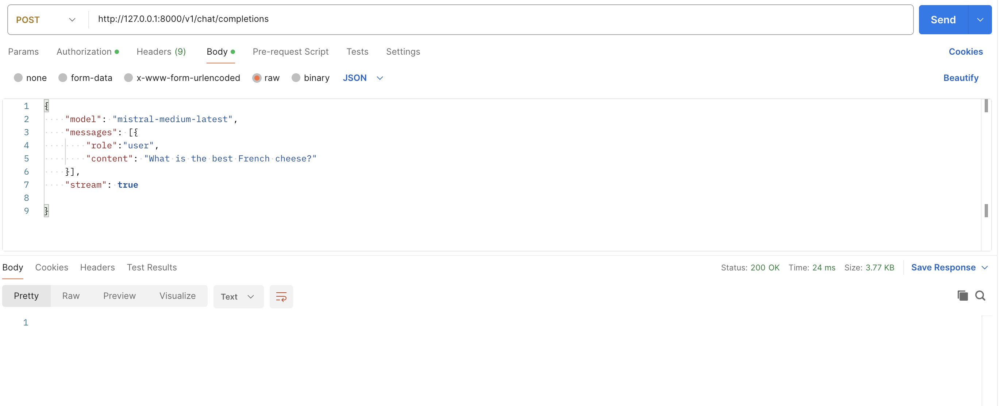

## FastAPI & Mistral AI

Cloning the Mistral AI using the FastAPI
Mistral AI Documentation: https://docs.mistral.ai/api/#operation/createChatCompletion

In this project, we will clone the Mistral AI Endpoints


## Project Overview


### Usage
```bash
# Run server
uvicorn main:app --reload
```

Create .env file and set the BEAR_TOKEN_API_KEY=<token-value>

**Option 1: Use Postman**



**Option 2: Use `test_stream.py` file**
```bash
python test_stream.py`
```

### Features
1. Return the response without streaming 
No streaming response

1. Return the streaming response from fake generator
Streaming response with FastAPI

1. Return the streaming from Langchain
Streaming response with FastAPI + Langchain
